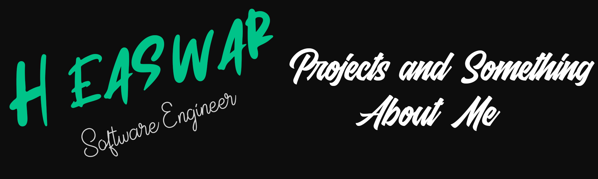
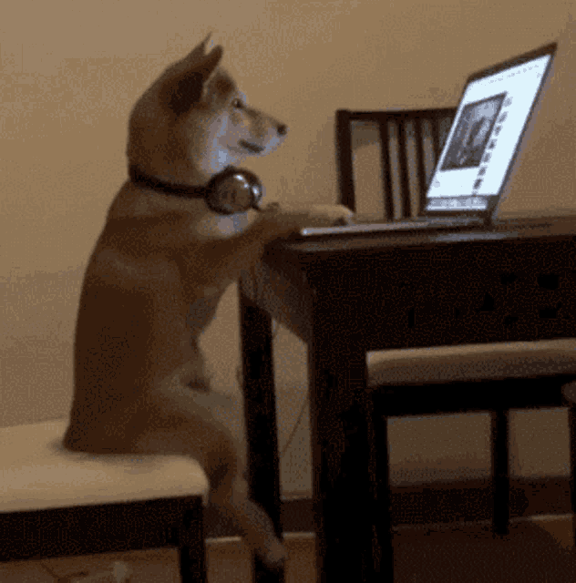

<h1 align="center">Hello there👋, I'm Easwar H</h1>
<code></code>
<h3 align="center">👨‍💻 Coding Dreams into Reality | Frontend Enthusiast, Full Stack 🌟</h3>
<code></code>
- 🔭 I’m currently working on React<code></code>Redux <code></code>
& Node <code></code>

- 🌱 I’m currently learning **React<code></code>**

- 👯 I’m looking to collaborate on **Short form Content Creation**

- 💬 Ask me about **Web Development**

- 📫 How to reach me:
  - **:** <a href="https://www.linkedin.com/in/easwar-harikaran-07764321b/">LinkedIn </a>
  - **:** easwarharikaran1610@gmail.com

- 📄 Know about my experiences -(Portfolio website in the making)

- 😄 Pronouns: **He / Him 👨‍💼**

⚡ My Most Used Language

 
  

📈 My Github stats

 
  
